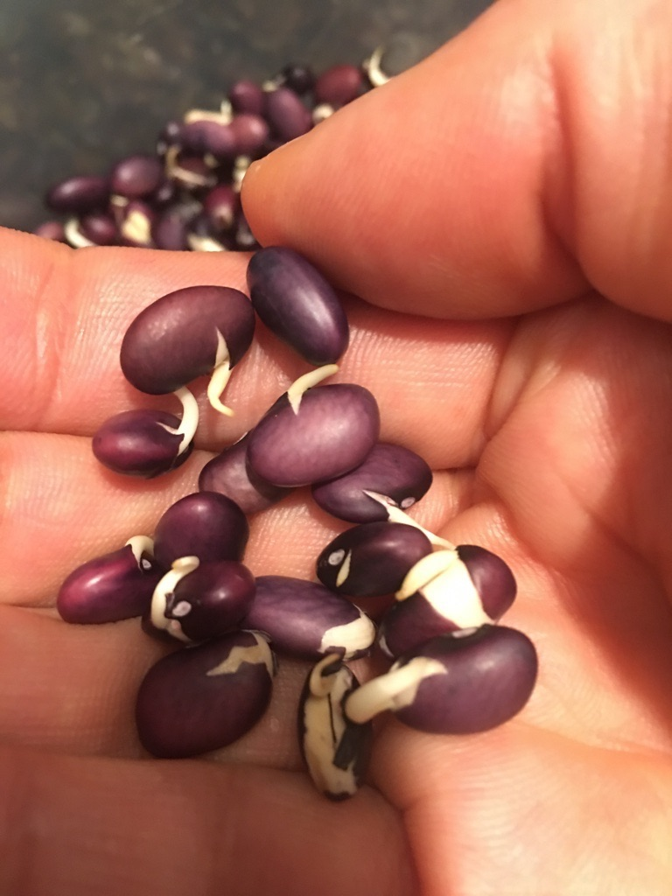

---
categories:
- beans
- food
tags:
- beans
- food
title: Beans
---

Versatile and healthy, especially when made from dry beans.

***

Soak dry beans overnight, or for at least 8+ hours.

[Black Bean Tofu](Black%20Bean%20Tofu.md)

[Mexican Echiladas](Mexican%20Echiladas.md)

If you soak black beans overnight, empty the water and let them dry for a day or two, they will sprout. I discovered this by accident when I had soaked too many beans and wanted to save the rest for later. Technically known as a radicle, the tiny shoots that emerge from the bean “seed” are embryonic roots that, if left in soil, would eventually sprout into a full-blown bean plant.

