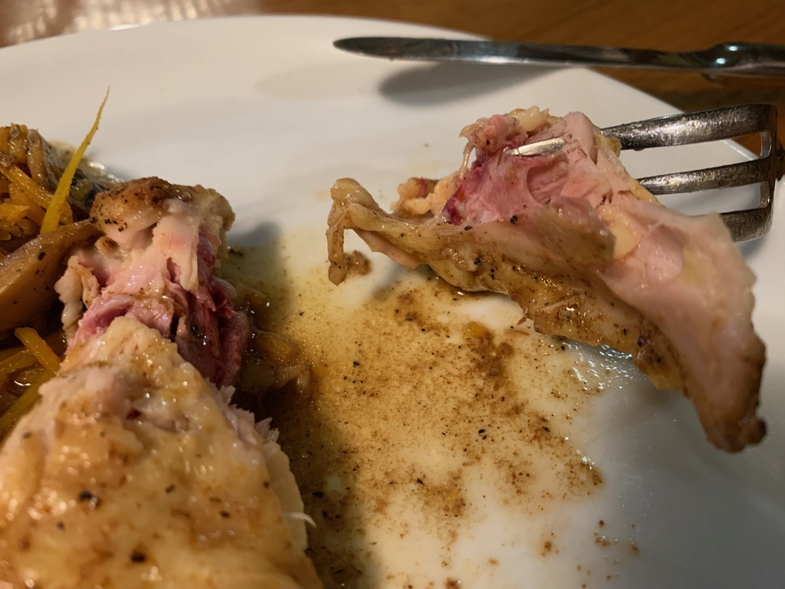

---
categories:
- sousvide
- poultry
- chicken
title: Sous Vide Chicken
---

## Chicken thighs (Bone-in)

### General Advice

Use a temperature of 160ºF or higher, for 3 hours.
You can try as low as 155ºF but it won't fall off the bone as well.

5 hours at 148.5ºF works well too.

Dump on the spices. Don't be shy. All that cooking will result in bland flavor unless you over-compensate.

***

2023-07-17 6:00 pm

158ºF for 3 hours worked nicely.  I dumped a ton of Old Bay seasoning in the bag, along with a few tablespoons of ChinKiang vinegar.

***
2023-04-23 6:13 AM

3 hours at 148.5ºF, with a marinade of fresh ginger, soy sauce and a little fish sauce. Then about 20 minutes on the grill. Quite flavorful and tender.

2023-03-19 8:04 PM

5.5 hours at 148ºF worked best ever.  It was the right amount of juiciness.  Finished off on the grill for perfection.

**2023-03-05 7:50 PM**
4 hours at 158ºF worked fine, though I'd like more off-the-bone.
Maybe 160 is better.

**2023-01-15 7:42 PM**
3 hours at 157ºF is pretty good.

**2022-06-09:**  2.5 hours at 159ºF and it tastes okay -- juicy, though could be a little more off-the-bone.

**11-29**

From frozen, I first unthawed it for 1 hour at 140ºF.
Then 3 hours at 150ºF followed by 5 minutes under the broiler.

Disappointingly chewy, with a rough red interior. 

**10-13 Japanese miso style**
smothered with koji, miso, and mirin, plus honey for 3-4 hours.
155ºF for 3 hours

**2021-09-29 146ºF for 4 hours**

Next time maybe up the temperature to 150.

I took a frozen pack and placed it in the sous vide pot for an hour to unthaw. Then I seasoned the package and set the temperature and timer.
Tasty but unsightly with obvious red marks and difficult to separate from the bone. There’s much less excess juice this time, probably due to the lower temperature. I think that makes the chicken more tasty.
Spicy perfect: I put in about 1 TBS of pepper, 1 TBS garlic salt, 1 TSB of red pepper flakes, plus 2 TBS red wine vinegar.

**2021-08-26 from frozen**
149.9 for 2 hours. Texture is disappointing (chewy).

**2021-03-21**
From frozen in the original Costco packaging, I cooked at 155ºF for 3 hours. Then I took it out of the packaging, transferred to a ziplock bag into which I put garlic, mustard, maple syrup, celery salt, and some lemon juice. Place the new batch into the water again, this time at 148ºF for 2 hours. Finally, I set it in the oven on high broiler for 5 minutes.

The final result was disappointing. Although it was fall-off-the-bone tender, the flavor is missing.

Next time: start with a lower temperature (e.g. 140ºF for 2 hours, or maybe less time), then add spices and marinate before setting on a higher temperature.

**2021-02-08**
160ºF for 3 hours, this time loaded with extra amounts of spice, especially pepper and crushed red chiles. Turns out fairly tasty, though next time don’t be shy about salt.

* * *

**2021-01-28**

155ºF for 4 hours in the original Costco packaging

Broil for almost 10 minutes and then load it up with salt.

* * *

**2021-01-11**
165ºF for 4 hours. Marinade = mustard, honey, vinegar.

**2020-12-23**

Marinated with soy sauce, white wine, mirin, ginger

149ºF for 2.5 hours.  Turned out a little too mushy.

* * *

**2020-12-08**

Ginger, soy sauce, fish sauce, garlic, tamarind.

148º F for four hours

**2020-12-03**

This time with a different marinade: miso, soy sauce and honey. I set in the pot at 2, but apparently it took most of an hour to heat up fully to 150ºF. I took it out at 6pm (about 3 hours of full heat)

Then I broiled it a little long–about ten minutes–producing just the right amount of carmelized marks.

Meat still sticks a little too much to the bone.

Next time go even higher temp: 160ºF but perhaps less time (3 hrs)

* * *

**2020-11-29 higher temp**

155ºF
4 hrs
Final result was a little chewy, and not a lot of juice.

Next time try 150

* * *

2020-11-24 Slightly higher temp

This time I tried 148ºF for 4 hours

Results didn’t seem distinguishable from my previous attempt: still quite tasty. Still a little stuck to the bone, still about 3/4 cup juices left.

* * *

2020-11-10

145ºF for 4 hours  (start at 1:30) to see if it turns out juicier (supposedly it loses more juice at higher temperatures)

Maybe 1/4 cup koji,  some chopped garlic and ginger, and a tablespoon or two of dark soy sauce to give it color.

Place under the broiler for 3-5 minutes.

Results are quite good (probably 3/4 cup of juices gathered).

Next time: there is still meat clinging to the bone, so consider higher temperature.

Also, feel free to go to town on the spices and aromatics. The final result was more bland than I’d hoped.

* * *

## Whole Chicken (Spatchcocked)

2023-11-23 8:46 PM
147ºF for 4 hours, then set it in the oven at 450ºF and broiler on high for a couple of minutes. Turned a nice golden brown.
It's cooked perfectly, not dry at all.

2022-11-20 
One gallon-sized bag and two quart-sized bags. I did 149ºF for 4 hours.

2020-10-03

I cut into pieces and placed spices into three bags, one for wings, another for thighs, and the final one for the main breast.  All into the pot at 150ºF for 3.5 hours, followed by ten minutes in a preheated 350ºF oven on high broil to brown it.

Results: very tender and juicy, especially the breast meat. I also collected about a cup of chicken broth in the sous vide process.

Next time: add more spice — especially garlic.  You could let it sous vide longer, but it’s not clear that would really help all that much.

As an experiment, maybe try adding lots more spice (garlic, onion, lemon?) to the sous vide bags, and then run it at 145ºF for 6 hours. (though note that  no more than 4 hours)

* * *

## Chicken breasts

2020-07-12

I didn’t notice that I’d unthawed a 6-month pouch of Costco frozen chicken breasts, so I treated them like thighs and put them unseasoned right in the original packaging, sous vide at 165ºF for 3 1/2 hours.  They came out very soft, as you’d expect, almost with a buttery texture.  Sous vide from noon - 3:30, and then I put them in a garlic/honey/ginger/soy marinade for a few hours in the refrigerator.

Not recommended. Turned out dry, chewy, and tasteless.

***

**2020-05-19 chicken thighs**

I rubbed them with koji for 24 hours and then added to a sous vide pot preheated on the stove to 165F.

To slow evaporation, I covered as much of the pot as possible with an aluminum flat pan.

sous vide at 165 for 4 hours  (started at 2:00pm till 6pm).

I then pan sauteed it on a non-stick pan with a little oil. Just 15 seconds or so, enough to brown the skin part.

Quite tasty: the perfect amount of tender

This simple setup was enough to prevent evaporation during the 4 hour cooking process

inspired by: [Serious Eats](https://www.seriouseats.com/2015/07/the-food-lab-complete-guide-to-sous-vide-chicken-thigh.html#bone)

* * *

## Chicken thighs

2020-02-08

I placed one of the Kirkland fresh (organic) boneless/skinless packages into the sous vide pot, unopened and unseasoned. 149.5 degrees, started at 1:15, ended at 4:30.  Then I removed them from the plastic wrap and put them into a ziploc with garlic/ginger/soy sauce/brown sugar. Then marinated in the refrigerator overnight.

## Bone-in chicken thighs in original packaging

2020-08-27

Another attempt …  I just threw the original Kirkland packaging into the pot at 8:00am and set for 149.5 for 3 hours.

When I came home at noon, I removed the thighs from their packaging and marinated in the refrigerator with some cooking red wine plus a salt/poultry seasoning mixture.  Then at 5:30pm I took out of the refrigerator and placed in a 350º pre-heated oven and set on broil for 5-10 minutes each side.

The result was perfect, fall-off-the-bone tender, though the flavor was a little bland.

Next time, skip the marinade and just apply a thick layer of some type of BBQ sauce. If you’re going to broil it, might as well lather on the sauce.

