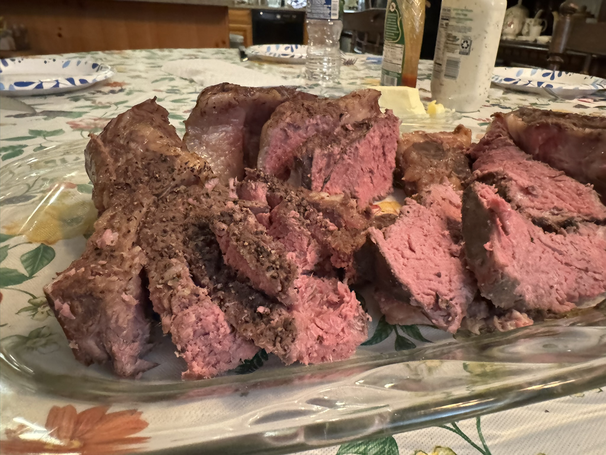

---
categories:
- sousvide
- grill
- beef
title: 'Sous Vide: Beef'
---

 
 
 ## Evaluating Beef Cuts
 
|Cut           |Tenderness       |Typical Sous Vide Time (hours)|Price|
|--------------|-----------------|------------------------------|-----|
|Filet Mignon    |Very Tender      |1-2                           |$22  |
|Ribeye        |Tender           |2-4                           |     $20 |
|New York Strip|Tender           |1-2                           |    $17 |
|Hanger Steak  |Moderately Tender|1-2                           |     |
|Prime Rib     |Moderately Tender|4-8                           |    $19  |
|Flank Steak   |Moderately Tough |4-8                           |     |
|Chuck Roast   |Tough            |24-36                         |     |

## Round Steak

2022-06-08 

Several days marinating with Koji and garlic. 129ºF for 3 hours. Then quickly pan-sauteed to brown it. Meat is juicy enough, but tough, possibly because the cuts were relatively cheap.  [Reddit argues](https://www.reddit.com/r/sousvide/comments/5f91nc/top_round_steak_what_time_and_temp/) it should be 131ºF for 4 hours (or all the way to 24 hours)

## Strip Steak

2023-10-02
5 hours at 137ºF

## Tenderloin

2024-11-23
After two days sitting in koji, I tried sous vide 125ºF for two hours.  Turns out very soft and tasty.
Warning: my notes say 125 but I'm not positive that this is not a misprint.

2023
I marinated with miso, soy sauce, mirin, and a bunch of shredded ginger. I bagged it at 1pm and let it sit for an hour. Turned on the sous vide at 128ºF for two hours, followed by 137ºF for another 2-3 hours. The final result was wonderfully soft, though a teensy bit chewy.  Next time try keeping it at the low temperature the whole time. [SeriousEats recommends](https://www.seriouseats.com/food-lab-complete-guide-to-sous-vide-steak#toc-temperature-and-timing-charts-for-sous-vide-steak) 120-128ºF for 2-3 hours

## Ribeye

2023-12-17 7:51 PM

Chewy and dull flavor when cooked 2 hours at 130ºF. Next time go back to the 137.5ºF version.

2023-06-15 8:40 AM

Perfect when cooked 3 hours at 137ºF (as strongly recommended on [Reddit](https://www.reddit.com/r/sousvide/comments/f6hn9o/i_thought_ribeye_at_137_for_2_hours_was/)).  Very soft and flavorful.

Next, try this:
* Put the meat in the freezer for 30 minutes
* Sear quickly on an avocado-butter oiled cast iron pan
* Place into sous vide bags with garlic, thyme, rosemary
* Sous vide at 137 for 2 hours
* Remove and place on a hot grill for 2 minutes

***

Current recommendation
130ºF for 2 hours, then grilled

2023-04-28 
from 3:30 - 6pm at 129ºF, then grilled for 2-3 minutes per side.
Final result is a little more rare than I'd like. Next time maybe go back to 130 or even slightly higher.

2021-01-09 

This time 2 hours at 130ºF, which I think may be slightly better. The meat is less raw, especially after I set it in the broiler for 5 minutes.

**2020-12-09 Ribeye**

60 minutes at 129ºF, followed by broiled both sides for 5 minutes each.

**2020-10-24 Ribeye**
Following Kenji’s SeriousEats instructions:

- liberally seasoned with salt, pepper, thyme, and rosemary, and a pat of butter (in the sous vide bag)
- 60 minutes at 129ºF
- Broiled 5 minutes on each side

Turned out soft and flavorful.  Next time I’d be nice to try finishing on the grill instead of the broiler.

* * *

## Rib Roast

2024-12-24

No seasoning, just dropped the 7 pound rib roast in its original packaging. Started with a 132ºF long sous vide overnight (12+ hrs) till about 9am. Removed it, cut it into smaller chunks, seasoned and bagged separately.  Then another 4 hours at 136ºF.

Note: it can take a full hour for a large container of water to heat to 136ºF.

Because we had no other containers that fit, I used a storage bucket, leaving the sous vide wand dangling in the water. 

## Chuck Roast
2023-05-23

I have a frozen 2 lb piece that's been in the freezer for more than 3 years ("sell by 4/30/20").  After smothering the frozen block with salt, pepper, and garlic powder, I placed it in a gallon freezer bag and submerged it in our sous vide container.  Set it for 135ºF and 29 hours.  I ran it at 27.5 hours and it tasted pretty good, definitely not chewy.

via [Nerd Chef](https://www.nerdchefs.com/sous-vide-chuck-roast-recipe/)

## Round Roast

2020-10-06 
Inspired by [Anova](https://recipes.anovaculinary.com/recipe/bottom-round-beef-roast-3)

I unthawed a 2.5 lb top round roast, rubbed it with garlic, a tablespoon of salt, 1 tablespoon pepper, and a teaspoon of thyme.

Sous vide at 130ºF for 21 hours (8pm till 5pm the following day).  Then I seared it in the Instant Pot (using the juices for a mushroom dish)

Tastes good, reasonably soft. But it’s not “buttery”.  I’m not sure if other preparation methods (e.g. slow cooker) would achieve better results.  Might be interesting to try splitting it into two smaller parts and sous vide each separately.  Or let the whole thing go much longer (e.g. 30 hours)

* * *

## Ground Beef

2021-09-05 

135ºF for 90 minutes. Then lay on the grill for 1 min each side.
Final taste is quite good, though they're not charred as much as I'd like.

2020-06-21

129º F for 60 minutes. I placed the carefully-shaped plain burgers in sandwich bags (not freezer bags).

Then on the grill for about 1 minute each side.

Stowe complains that the color looks raw, but I think they’re quite tender and juicy.

Next time consider adding something extra, like cheese to the meat.  (e.g. [Pesto stuffed hamburgers](evernote:///view/748304/s7/778c8747-3c84-4ed1-b4f5-f54cf54c7dc6/778c8747-3c84-4ed1-b4f5-f54cf54c7dc6/))

inspired by [Anova](https://recipes.anovaculinary.com/recipe/sous-vide-hamburger)