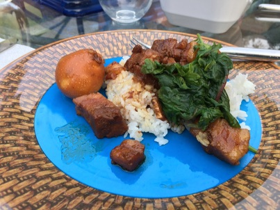

---
categories:
- pork
- instantpot
- bestof
- japanese
- Chinese
- recipe
title: Pressure Cooker Pork Belly (Kakuni)
---

Kakuni is a Japanese-inspired dish that normally requires several hours to prepare. This Instant Pot version can be on the table 75 minutes after you start.

***

**Cook Time 50 mins**

### Ingredients

- 3 green onions/scallions (use only the green parts)1 inch ginger
- 1 Tbsp neutral flavor oil (vegetable, canola, etc)
- 2 lb pork belly block (2 lb = 907 g)
- Water (for cooking pork belly)
- 4 boiled eggs
-  Togarashi (Japanese seven spice) (for taste, optional)

**Seasonings**
- 1⁄4 cup sake (1⁄4 cup = 60 ml)
- 1⁄2 cup water (1⁄2 cup = 120 ml)
- 1⁄2 cup mirin (1⁄2 cup = 120 ml)
- 1⁄2 cup soy sauce (1⁄2 cup = 120 ml)
- 1⁄4 cup granulated sugar (1⁄4 cup = 50 g)

### Instructions

1. We will only use the green parts of the green onions (use the white parts in miso soup to go with this dish).
2. Cut the green parts in half. Peel the ginger and slice it thinly.
3. Press the “Sauté” button on your Instant Pot and heat the oil. Cook the pork belly.
4. You can skip this part to cut down the cooking time, but this process will render more fat and make the dish tastier.
5. Pour water to cover the meat, then add the green onions and sliced ginger. Cover and lock the lid. 
6. Press the “meat/Stew” button to switch to the pressure cooking mode. Cook under pressure for 35 minutes.

When it is finished cooking, unlock the lid and drain the cooking water and discard the greenonion and ginger. Rinse the pork belly under warm water.

2. Put the pork belly back in the Instant Pot and add water, sake, mirin, soy sauce, and sugar. Mix and add the boiled eggs. Press the “Sauté” button on the Instant Pot and press “Adjust”once to increase the heat. Bring it to simmer to let the alcohol evaporate. Once the alcohol smell is gone, press “Keep Warm/Cancel” button to turn off the Sauté mode. Cover and lock the lid. Make sure the steamrelease handle points at “sealing” and not “venting”. Press the “meat/Stew” button to turn on the pressurecooking mode. Press the “minus” button to decrease the cooking time from the preset 35 minutes to 10minutes.

3. When it is finished cooking, the Instant Pot will switch automatically to a “Keep Warm” mode. Slide the steam release handle to the "Venting" position to let out steam until the float valve drops down and unlock the lid. Ifyou have time (this is optional), press the “Sauté” button and simmer on low heat until the liquid in the cookerhas reduced by half.

4. Serve the rice in a (donburi) bowl and pour the sauce on top. Place the pork belly and egg (add blanchedgreen vegetable if you have any). Pour additional sauce over the meat and serve immediately. If you like it abit spicy, sprinkle shichimi toagarashi (Japanese seven spice).

***

Pressure Cooker Pork Belly (Kakuni) 角煮 (圧力鍋)
via [Just One Cookbook]()
http://www.justonecookbook.com/pressure-cooker-pork-belly-kakuni/) 1/2
8/6/2017 Pressure Cooker Pork Belly (Kakuni) 角煮 (圧力鍋) • 
http://www.justonecookbook.com/pressure-cooker-pork-belly-kakuni/ 2/2

***
 Experience
2020-12-14 normal

boil the eggs while waiting for the first 35-min cycle to complete, and then you can let them cool and peel before the second cycle.

* * *

4/22/2019

With daikon, mushrooms, and some gobou (add to the final 10-minute cooking session)… still tasted reasonable.

Use the 35 min initial cycle to boil and cool the eggs, and add liquid to dried mushrooms.

More spice or richer flavor would help.  Maybe use togoroshi?

* * *

11/16/2018

I added a few tablespoons of cumin while sauteing the meat. [ no noticeable difference]

Costco pork belly was $21 for ~5.3 pounds, of which I used half.

* * *

10/22/2018: in step “pour water to cover the meat”, I only poured 1/2 cup….not nearly enough to cover it.  The meat turned out chewy.

I used 1.37 lbs of pre-cubed pork belly from Uwajimaya $7.50

* * *

9/28/2018
Start at 5:30, in the table at 6:45
Try mushrooms

2/15/2018:

In the kitchen at 4:47, the Instant Pot countdown started at 5:15.  We were sitting down to eat at 6:15.

Surprisingly tasty and quick.

* * *

Made it on 8/6
started at 5:37
It was on the table at 7:07

No sake, so I substituted white cooking wine which was okay, but i think sake would have made it more japanese-flavor.

The secret is that last 10 minutes of cooking *after* you pressure cook the pork.

* * *