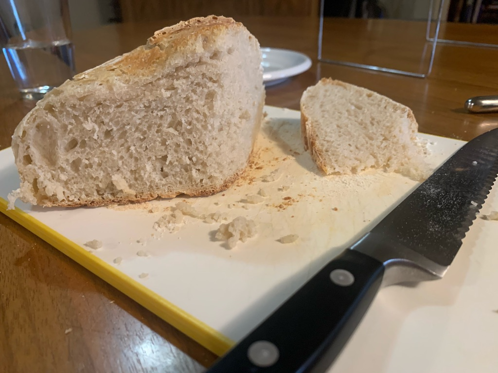

---
categories:
- sourdough
- bread
- recipe
title: Sourdough Bread
---

Now in [Evernote](https://www.evernote.com/shard/s7/nl/748304/73f1e712-aec0-4907-96f8-60cbeab6013b/)

Inspired by [Alexandra's Kitchen](https://alexandracooks.com/2017/10/24/artisan-sourdough-made-simple-sourdough-bread-demystified-a-beginners-guide-to-sourdough-baking/):

## Ingredients

- 50 - 100g sourdough starter
- 375g warm water
- 500g white bread flour
- 11g sea salt

## Directions

Mix all the ingredients, folding and stretching several times over a period of up to two hours.

Cover with a towel and let it rise for 8 - 10 hours.

Refrigerate overnight.

Use a kitchen scissors to cut a strip down the middle.

Bake at 500ºF in a pre-heated dutch oven for 30 minutes covered, then 15 min uncovered

## Results

The final loaf weighs about 900g (2 pounds)

* * *

## Variations

* * *
**2021-04-17  Rye Half Loaf**

mixed in the bread machine at 4:30pm, let it rise overnight today's unusually warm weather. Transfer to the croquet pot and let it rise another hour or two before setting in the oven.

- 50g Rye flour
- 200g white wheat flour
- 175g (or mL) water
- 5g salt
- 25g sourdough starter

***

**2021-02-07**
total hands-on time was about 12 minutes:
* Use the bread machine to knead the dough.
* Let it rise in a temporarily-heated oven for several hours
* Refrigerate overnight

**2021-02-01 Whole Wheat**
Half loaf recipe:

- 120g White Whole Wheat
- 150g Bread Flour
- 5g salt
- 25g sourdough starter
- 150g (or mL) water

Mixed in the bread machine (which worked great this time) at 7pm - 8:30. Rise in a 100ºF oven for 2 hours, then refrigerator overnight.

take it out of the refrigerator for 30 min, place in the baking pan, and put in the oven:
30 min covered
15 min uncovered

Steve Wasserman ([Facebook](https://www.facebook.com/richardsprague/posts/10105947816300253?comment_id=10105948320914003&reply_comment_id=10105948837503753&notif_id=1612145477700041&notif_t=comment_mention&ref=notif)) suggests (from [Jamie's Mill](https://www.janiesmill.com/)):

> ~30% whole wheat + other grains like Einkorn for flavor (Turkey Red is one of my favorites). Seeds. Mmmm...

* * *

**2021-01-30** I've tried variations with half the ingredients, to make a smaller loaf. Works well when I: knead the dough in the evening before bed, set it in the oven (a 100º oven with heat turned off) and then do the regular baking after waking up in the morning.

**2021-01-10 bread maker**
Put the ingredients into the bread maker on dough setting. It takes about 1:30hrs.

I started at 8am. Put the dough into a small glass bowl at 9:30. Heat the oven for a minute or two at 350ºF and turn it off. Place the dough inside the oven for an hour or two to let it start to rise. Then put it on the kitchen counter until about 4pm, by which time it had risen enough to spill over the top of the bowl. Refrigerate overnight.

**2021-01-11 breadmaker 2**
Started at 7:30, this time with everything in the machine from the start.

I had to add more than a full cup of additional flour to the machine (maybe 100g) to keep the mixture doughy enough. Even that wasn't enough. Next time dry less water.

**2021-01-14 Half Loaf**

Cut all ingredients in half to make a smaller loaf. Started rising by 8am. Let it rise throughout the day, baking it from 5:30pm in a smaller pan. I didn't bother with the bread machine. Just hand-knead and keep in a small glass bowl.

**2021-01-15 pancakes**

Inspired by [iambaker](https://iambaker.net/sourdough-pancakes/), I whipped up a batch of pancakes with the sourdough discard, which at this point smells like nail polish. I didn't measure carefully so maybe it's my fault but the pancakes weren't fluffy or otherwise special.

## Microbiology

There's nothing special about San Francisco sourdough. Microbiologically speaking, all sourdough starters are roughly equivalent according to this new study: https://elifesciences.org/articles/61644