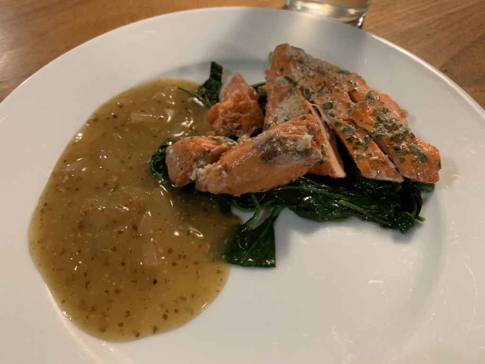
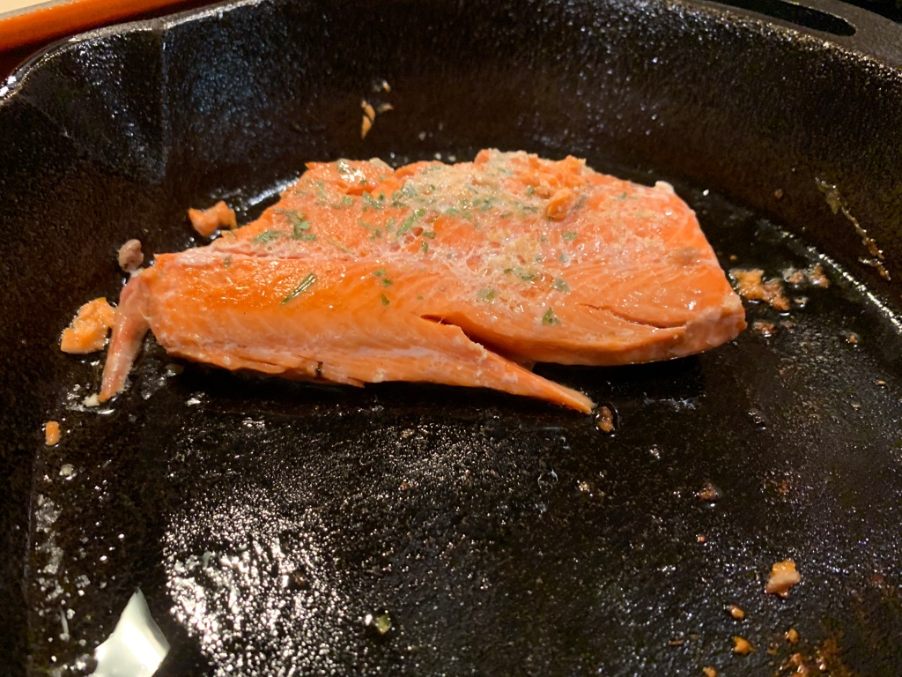

---
categories:
- sousvide
- salmon
title: 'Sous Vide: Salmon'
---

115ºF at 45 minutes is the ideal way to cook salmon.

2023-01-30
Trout is much like salmon. We tried it at 130ºF for 45 minutes with some thyme (no salt) and lemon, after a few hours brining in saltwater. 

Stowe doesn't like the "fishy" taste.

2022-10-03 2:54 PM

I brined the salmon right in the quart-sized ziplok, using a ton of salt and some brining flakes I had leftover in the cupboard.  Leave it sit in the brine for 30 minutes.

Take it out and sous vide for 45 minutes at 115ºF.  Remove the skin and pan fry for about 2 minutes on each side. Just salt and pepper.

## Salmon Quinoa Bowl

2022-01-25 7:25 PM

inspired by [A Day In Motherhood](https://www.adayinmotherhood.com/chipotle-salmon-quinoa-burrito-bowl/)

* 1 TBS avocado oil
* 1 TBS chipotle sauce
* 1/2 tsp cumin
* 1/2 tsp garlic salt

Just a little on top before setting the salmon on a hot cast iron pan. Flip after 30 seconds or so and reapply.

## Salmon as a Topping

Use the salmon as a topping for a different dish (“buddha bowl”). (see [Notes 201005 Monday](evernote:///view/748304/s7/57f964a4-bea8-4592-9571-2fb16d4003b0/57f964a4-bea8-4592-9571-2fb16d4003b0/))

Because it’s relatively quick and hands-off, this is a good way to do salmon without much work.

I slathered it with aromatics (thyme, salt, pepper, tarragon)

2020-10-05 

* * *

## Salmon and Pesto

I bagged it with pesto
115ºF for 45 minutes, then cooled for an hour before quick-saute on a fry pan.
Turns out quite tasty.

2020-06-30

* * *

## Salmon (Simple)

inspired by: [Anova Recipe](https://recipes.anovaculinary.com/recipe/sous-vide-salmon-2)
115º F  for 45 minutes was about right,

Serve with some wilted spinach and a sauce (in this case, a jar of Williams Sonoma something we had in the refrigerator)

and the salmon came out very well, except I made one mistake: I seared it for so long that it ended up cooking it

2020-01-07