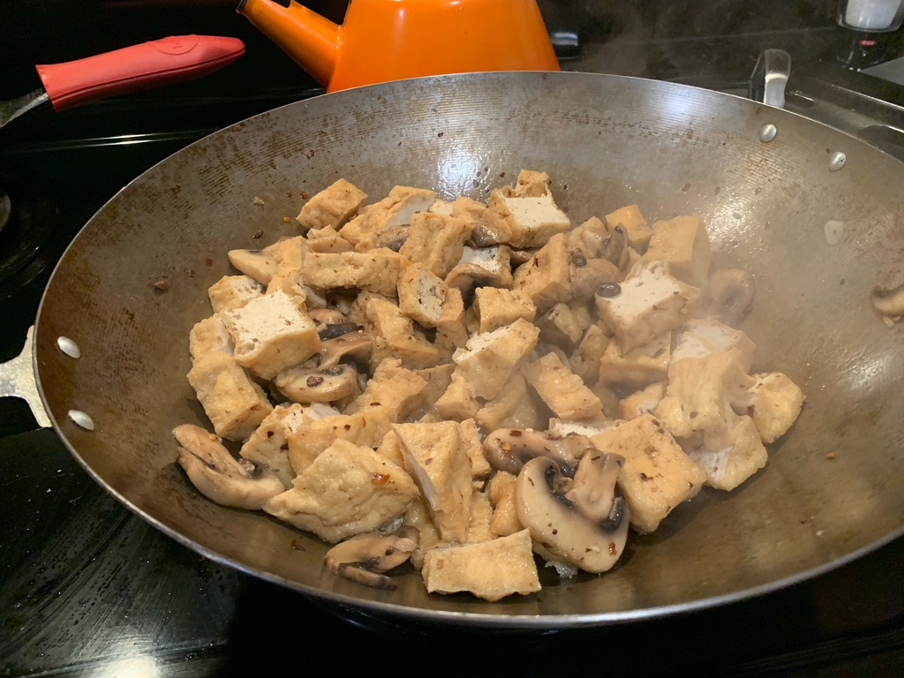

---
categories:
  - tofu
  - Chinese
  - recipe
title: Black Bean Tofu
image: BA6CEEE1-EC00-425D-BF3C-CA69D2C18452_1_105_c.jpeg
---

One of our favorite Chinese-inspired meals. Easy to make, last-minute, and goes well with other Chinese foods, especially coconut rice.

## Preparation

**Seasoning liquid**
- Boil two cups of water and 1 TBS or so of fermented black beans
- Wait 20-30 minutes for the liquid to boil down and concentrate the flavor
- Pour into a pitcher, using a mesh filter to keep the beans separate
- Add 2 TBS of soy sauce plus a shake or two of salt.

**Main ingredients**
- Chop the tofu and the mushrooms
- Chop some garlic, add some chilis and set aside

## Cook
- Heat the wok and throw in the garlic and chilis
- Toss in the mushrooms and give them a good stir
- Add black beans
- Splash in some Shoaxing (about 1 T)
- Add the tofu
- Pour in the seasoning liquid

(Optional) add a slurry of some potato or corn starch mixed with water (no more than 2 TBS)

