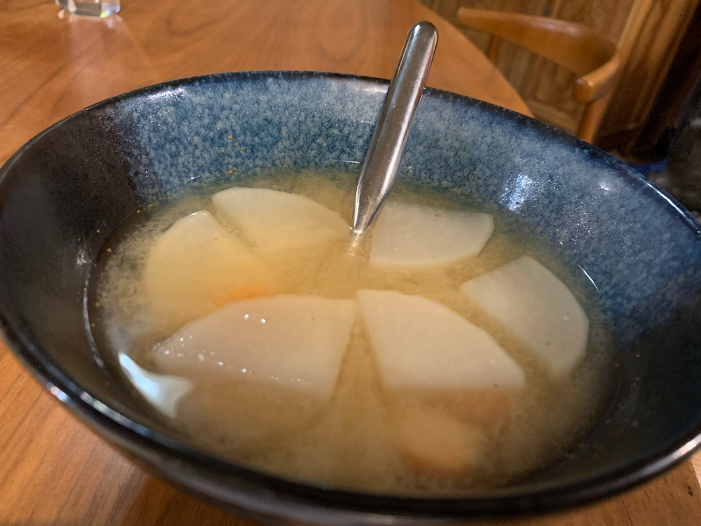

---
categories:
- instantpot
- japanese
- miso
title: Daikon Carrot Miso Soup
---

Inspired by [howtojapanese](http://howtojaponese.com/2020/07/22/how-to-make-miso-soup-in-an-instant-pot/)

Add peeled and chopped daikon and carrot to the Instant Pot, along with roughly a liter of water. 

Add 2 tsp of hondashi

Set on Manual Pressure High for 2 minutes. Leave it sit for at least 30 minutes, which is about how long it'll take to warm up, cook, and then naturally release.

Add a couple tablespoons of miso to taste.

Not super-delicious, though fairly satisfying when served hot. 

