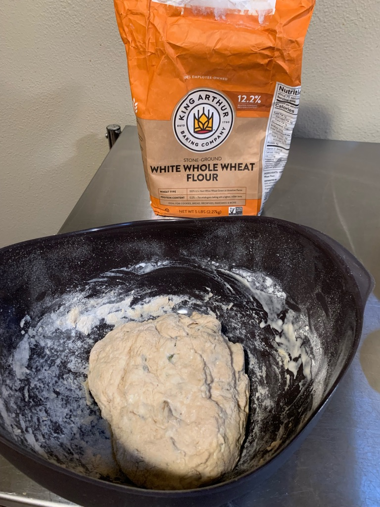

---
categories:
- bread
- recipe
title: Lékué Silicone Bread Maker
---

See [Lékué web site](https://www.lekueusa.com/products/bread-maker) [manual](https://cdn.shopify.com/s/files/1/0010/9956/3073/files/English_Bread_Maker_Recipe_Booklet.pdf?v=1610144649) ([offline](https://www.evernote.com/shard/s7/sh/e14a9057-87a6-47eb-aee4-7075bc547aa6/6633f340373f53e825f98384300a7a67))

* * *

## Sunflower Seed

 **2023-01-15 7:41 PM** this recipe worked 

- 20g flax seed (ground)
- 30g sunflower seeds flour
- 100g spelt flour
- 5g salt
- 5g proofed yeast

2023-07-16 3:42 PM
Another attempt

## Rye

Inspired by [Fuss Free Flavors](https://fussfreeflavours.com/recipe-mixed-grain-loaf/),
- 100 g strong white flour
- 100 g strong wholemeal flour
- 50 g rye flour
- 1 tsp salt
- 1 tsp dried yeast
- 166 ml water

Knead for 10 minutes, let rise for an hour, then stretch and fold in thirds, then rise for 30 minutes.  Bake 25-30 minutes 

The dough after 10 minutes of kneading has this consistency:

turns into 

If it's too wet, it looks like this

### Variations
2022-09-21 7:33 PM
I tried 75g of whole wheat flour
25g of pecans

and it turned out okay, though I still can't get it to turn super-fluffy.

## Brioche

- 250g regular flour
- 100ml water
- 64ml water + cream
- 20g sugar
- 8 g yeast

Make dough and then rest it for 2 hours. Scramble an egg and brush the dough.  Let it sit another 1.5 hours.  Bake at 385ºF.

## Rustic Corn Bread

- 200g regular flour
- 50g corn meal
- 5g salt
- 165ml water
- 5g yeast

The secret is to allow it to rise for a long time: 1.5 hours at first, followed by a punch down, followed by another hour, followed by reshaping, and then another hour or two of additional rise.

Cook at 420ºF for 25 minutes.

## Whole Wheat

Using a kitchen scale, I measure out

- 200g whole wheat flour
- 50g regular flour
- 5g salt
- 165ml water
- 5g yeast

Let it rise for 90 minutes, then shape it into a baguette and let it rise again for an hour.

Next time: to get it to raise more, try letting it rise longer? All afternoon?

***

## Quick and Easy

- 2 Cup flour
- 1 Cup water
- 1 tsp yeast
- 1/2 tsp salt

Came off slightly more salty than I’d like.

