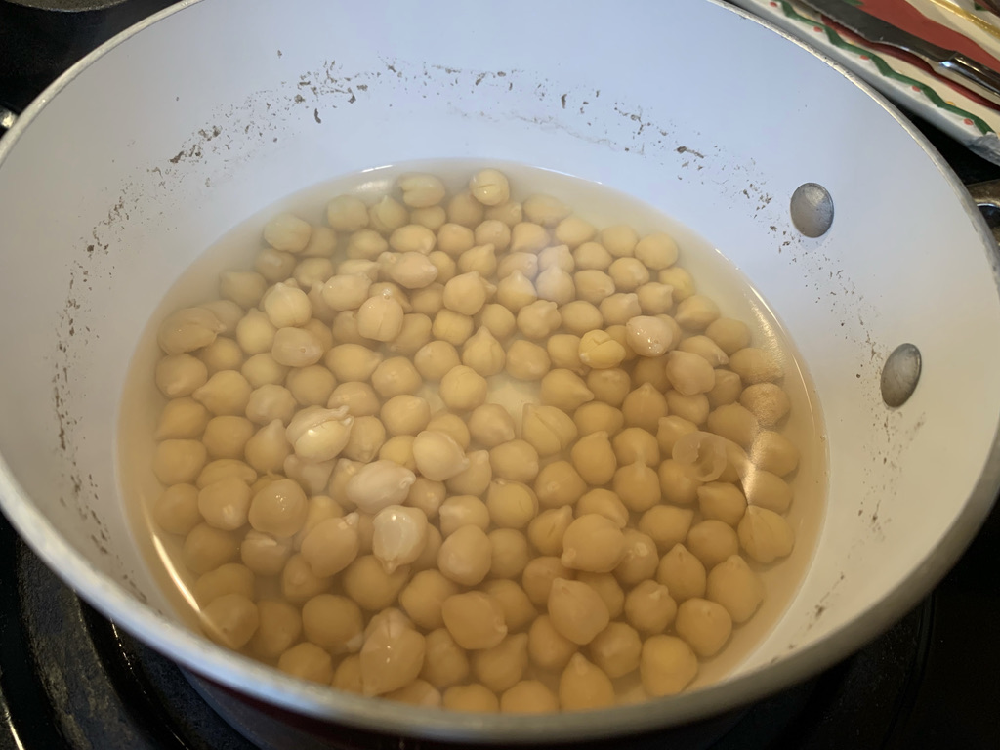
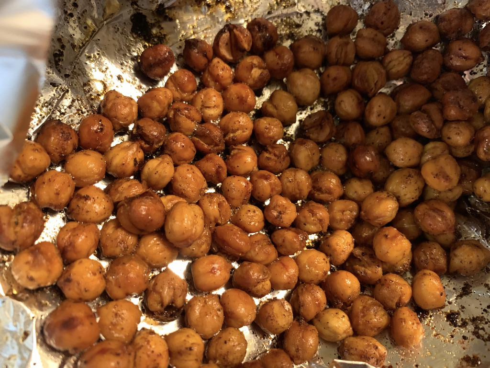

---
categories:
- recipe
- food
title: Roasted Chickpeas
---

Roasted Chickpeas

2021-10-11 8:17 PM

Inspired by [kitchn](https://www.thekitchn.com/how-to-make-crispy-roasted-chickpeas-in-the-oven-cooking-lessons-from-the-kitchn-219753),

I soaked dry chickpeas overnight, disposed the water, and boiled them for about 30 minutes.

Toss them with avocado oil, garlic salt and some spices. Then roast in a 400ºF oven for 30-45 minutes.

Surprisingly tasty!

