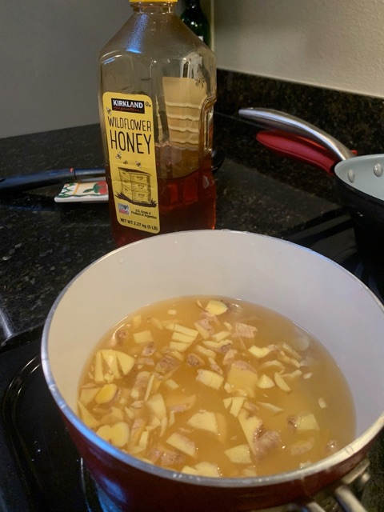

---
categories:
- ginger
- sodastream
title: Sodastream Ginger Ale
---

Sodastream Ginger Ale

Into a pot, add:
- Equal parts chopped ginger and honey (about 1/2 cup each)
- Double the amount of water

Boil for 60 minutes

Yes, it turned into a concentrated substance, but the final result when added to the carbonated water doesn't taste like ginger ale. Doesn't in fact taste much like anything.

***

