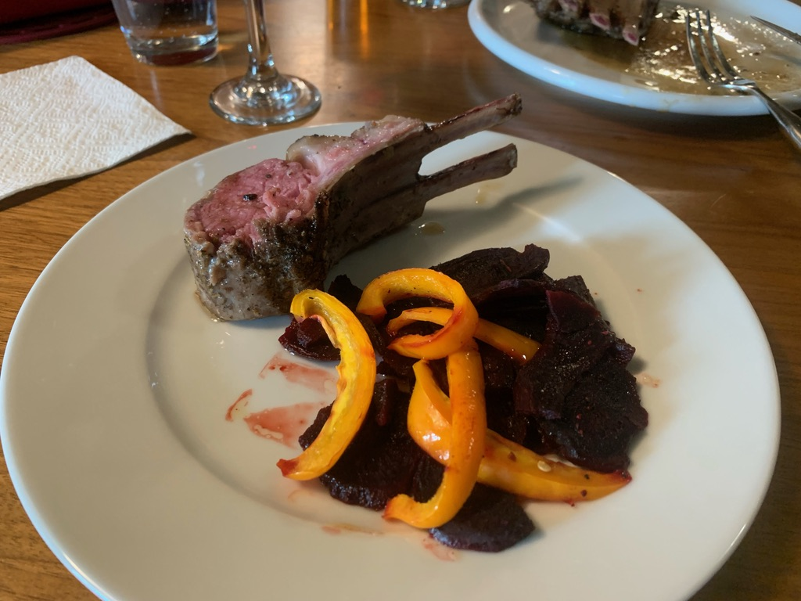
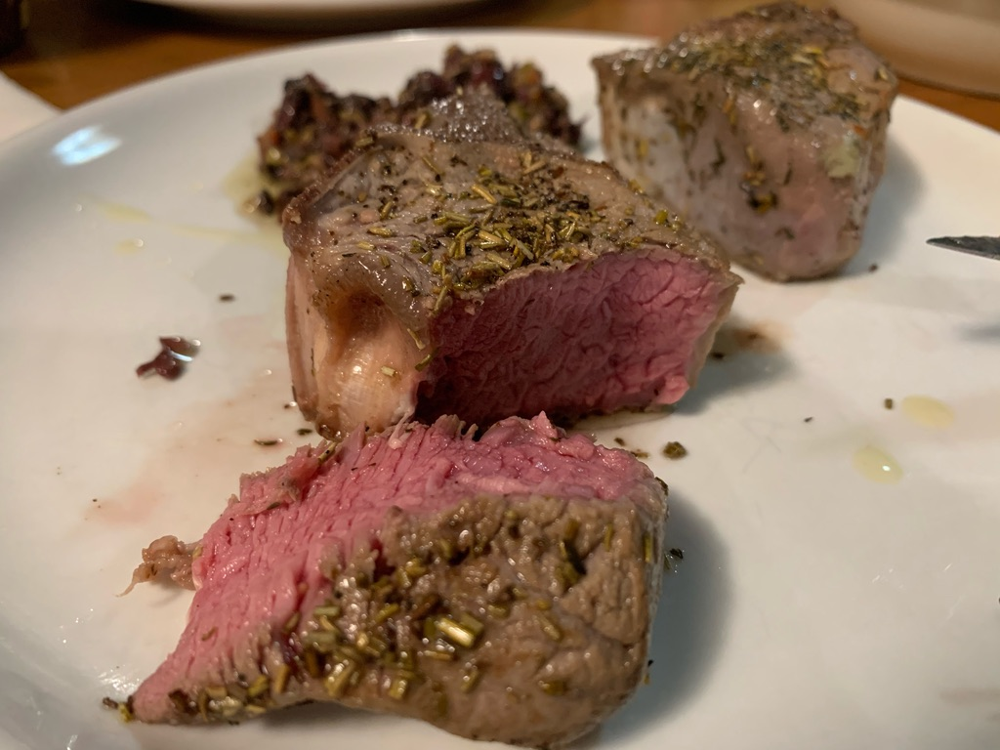

---
categories:
- sousvide
- lamb
title: 'Sous Vide: Lamb'
---

Sous vide is unquestionable the best way to cook lamb to perfection. 

2024-11-24

Bone-in Costco lamb chops for 7 hours at 131ºF.  Turned out chewier than I'd like. Maybe next time raise the temp to 133ºF and keep it in for 3+ hours.

2023-09-30
5 hours at 131ºF very tender.

**2021-12-11**  Under 3 hrs
About 3 hrs and results are the same.

**2021-05-06** More perfection
131ºF for 3.5 hours

A Costco 1.4 lb lamb rack ($[17](https://www.evernote.com/shard/s7/nl/748304/2d85bc72-8f19-4e42-9a3c-dfe3eba04c99/)). I removed it from the packaging, cut it into two parts with a scissors. Drop each half into quart-size ziploc bags seasoned with a little salt/pepper, crushed garlic, and rosemary.

* * *

**2021-04-04**
Final result was absolutely perfect.

131ºF for 3.5 hours. Packed as tightly as possible in a ziplock bag with just salt&pepper plus a clove or two of crushed garlic and a sprig of rosemary.

After removing from the bag, pat it dry and place on a skillet with olive oil and butter, as hot as possible. Throw in some more garlic and then place the chops pressed-down for no more than a minute, flip, and do the same to the other side. Remove immediately.

* * *

**2020-11-30**

Combined the fresh lamb (rubbed with rosemary, thyme, pepper, salt, garlic) and a frozen half pound ribeye (unseasoned except for a little garlic), cooking at 129ºF.

I set both meats in the pot at 2pm. The ribeye was finished by 3:30 so I removed it.

I raised the temp to 131ºF and kept the lamb cooking till 5:30.

* * *

Next time: try going longer (up to 3 hrs). Also maybe sear it longer to general more of a caramelized surface.

* * *

**2020-11-23**

First sauté them in a cast iron pan until they have obvious brown marks.

Add aromatics: rosemary, thyme, pepper, salt

Bag them and throw in a pat of butter, plus crushed garlic

* * *

Set to 131ºF for 1.5 hours

Result

