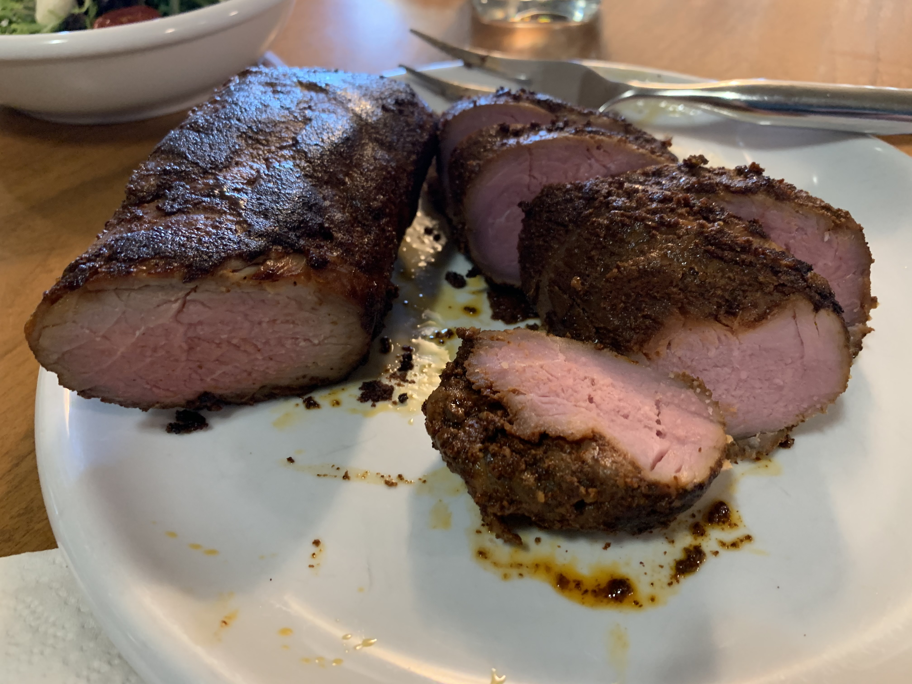

---
categories:
- pork
- sousvide
title: 'Sous Vide: Pork'
---

# Sous Vide: Pork

## Pork Rib

2023-10-05 11:12 AM

This time I dumped a bottle of Walmart Mole into the bag along with the ribs.  145ºF starting at 10am for 7 hours.

The mole was flavorful but too dry. Next time follow the instructions and actually melt the mole and 

2023-10-03 7:27 PM
Lacks flavor, believe it or not. Next time add something spicier: salt, definitely, or maybe some chili flakes or powder?

[Boneless Pork Ribs with Coconut-Peanut Sauce](https://recipes.anovaculinary.com/recipe/sous-vide-boneless-pork-ribs-with-coconut-peanut-sauce) from Anova

135ºF at 8 hours (I did it for 10+ hours)

### Ingredients

- 1/3 cup unsweetened coconut milk
- 2 tablespoons peanut butter
- 2 tablespoons soy sauce
- 2 tablespoons light brown sugar
- 2 tablespoons dry white wine
- 2 inches fresh lemongrass
- 1 tablespoon Sriracha
- 1 inch peeled fresh ginger
- 2 cloves garlic
- 2 teaspoons sesame oil

## Pork Belly

**2022-09-28 Another attempt**
This time I use pork belly that has already been cut into cubes.
I chose option 2, substituting regular onion for scallions. While I wouldn't say the taste was unusually good, the final product was reasonably soft and flavorful.

After 10 hours, I took the pork belly out of the bag and placed it in the oven on broil for ~5 minutes, letting it turn brown on top. 

I used the drippings from the sous vide bag, strained with a strainer to make a sauce. Next time, start the boiling process earlier -- give yourself at least 15 minutes to condense the liquid.

Finally, I mixed the liquid with some kewpie mayonnaise and drizzled it on the final product, served like a ton-don, over (brown) rice with some microwave-softened broccoli and topped with a few shakes of togarashi. 

### Option 1
- 1 cup soy sauce
- 2 TBS garlic paste or minced garlic
- 1 tsp ginger paste or minced ginger
- 2 TBS sesame oil
- 3 TBS chili with garlic sauce
- 1 TBS brown sugar

or
### Option 2

- 1/2 cup soy sauce
- 1/2 cup mirin
- 1/2 cup granulated sugar
- 2 tablespoons fish sauce
- 2 whole scallions, roughly chopped
- 3 medium cloves garlic, roughly chopped
- 1 (2-inch) chunk ginger, peeled and roughly chopped

at 170ºF for 10 hours

Inspired by [bombay](https://soufflebombay.com/sous-vide-asian-pork-belly/) and [seriouseats](https://www.seriouseats.com/sous-vide-pork-belly-bun-pork-braise-mayonnaise-quick-pickled-cucumbers-recipe)

***

**2022-01-19**
Inspired by [Bon Apetit Jan 2018](https://www.bonappetit.com/recipe/sous-vide-pork-belly-sweet-and-spicy), I marinated Costco Pork Belly strips with

- 1/4 cup honey
- 1/4 cup soy sauce
- 3 TBS sambal oolek

and set it in the pot at 165ºF from 8pm - 5 pm the next day.

Results were a little chewy, though the marinade flavor definitely made it through. I served it as a “bowl” on top of quinoa.

Next time try using lower heat (e.g. 147º F)

## Pulled Pork

**2021-08-12**
165ºF for 24+ hours. Exceptionally soft and delicious.

## Reheating

**2021-02-09**
I had frozen a batch of boneless pork chops that had been sous vided at 140ºF. Upon unthawing, I put them into an oven to broil for about 5 minutes. Tastes bland and tough. Next time unthaw in the refrigerator overnight, and consider pan-searing them instead.

## Pork Tenderloin

**2021-06-03** 130ºF for 3 hours, then 30min at 140ºF

It’s hard to screw up sous vide, so the taste was fine, but this one was less juicy and more like ham.

I think the traditional 140ºF at 1-2 hours is better.

**2021-04-12**
140ºF for 2 hours.
Works great.

**2020-05-27**

For a three-pound tenderloin:

- 3 TBS each of cumin, brown sugar, and chili powder.
- 1 TBS of crushed garlic and salt

Rubbed with cumin, brown sugar, garlic salt, and chili powder and then set it for a couple hours in the refrigerator.

Sous vide at 140º F for 90 minutes, then ice bath, then transfer to cast iron pan loaded with oil, press for 30s on each side to brown it.

Quite good.

**2020-06-18**
tried again, this time setting two ziploc bags in the immersion pot. I took one out and prepared it with the cast iron…  turned out perfectly.   The other bag I put in the freezer.

**2020-10-01**
Another pork tenderloin

This time 140ºF for 3 hours. Rubbed with oregano and cumin
Result: not sure longer is better

see [photo](evernote:///view/748304/s7/fc9008e4-1eb2-44ea-82d0-828ff77fa82e/fc9008e4-1eb2-44ea-82d0-828ff77fa82e/)

## Pork Chop (boneless)

**2023-11-03**
sprinkled with sweet rub. 4 hours at 140 seemed a bit dry.

**2022-01-24**

140ºF for 4 hours 4 hours with just salt & pepper, then a last-minute rub of  spices while 30-second braising on a hot cast iron pan.  

[Photo at Notes 220124 Monday](/index.html)

**2020-07-01**

Marinated with [Savory Mint Pork Chops Recipe on WeGottaEat](evernote:///view/748304/s7/3ef6c45a-4ad9-4dcd-8529-e72cfe72c443/3ef6c45a-4ad9-4dcd-8529-e72cfe72c443/)

140ºF for 4 hours